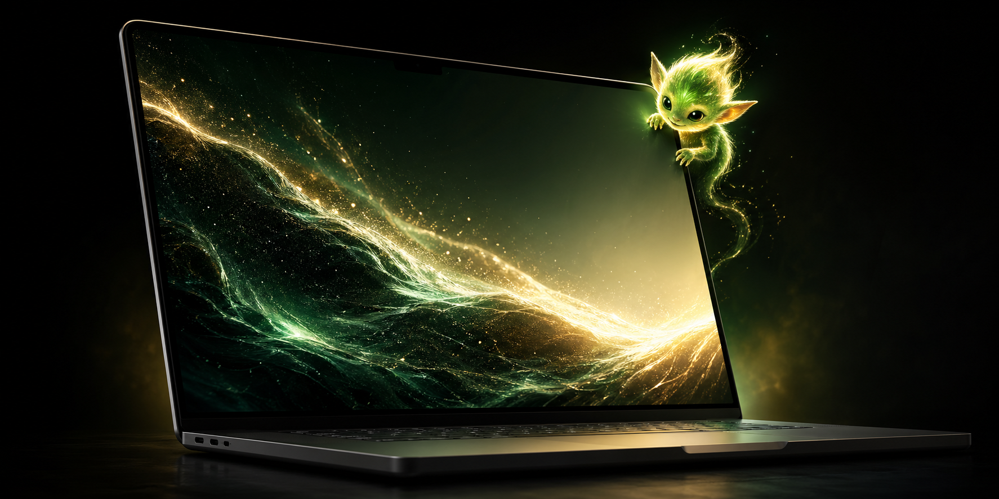
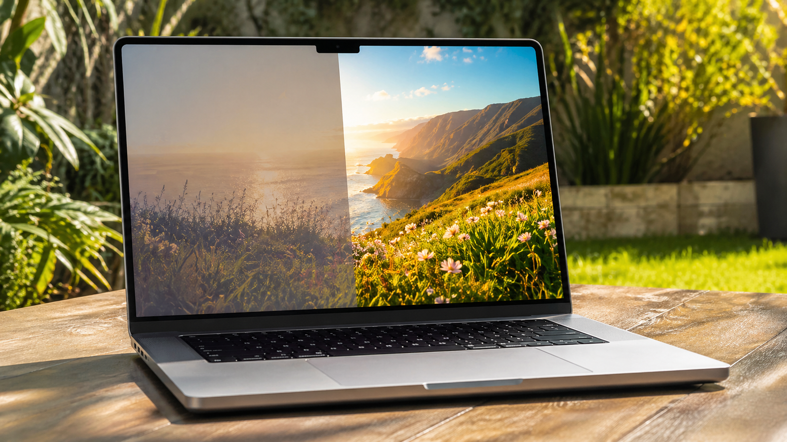
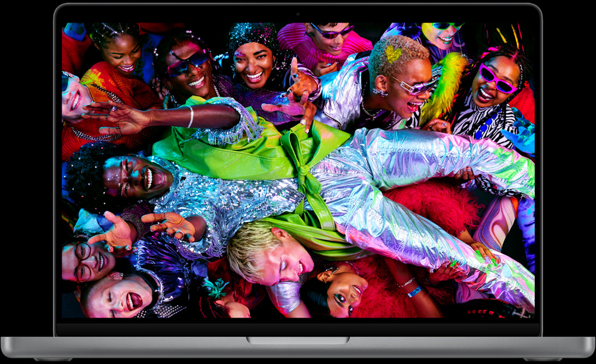
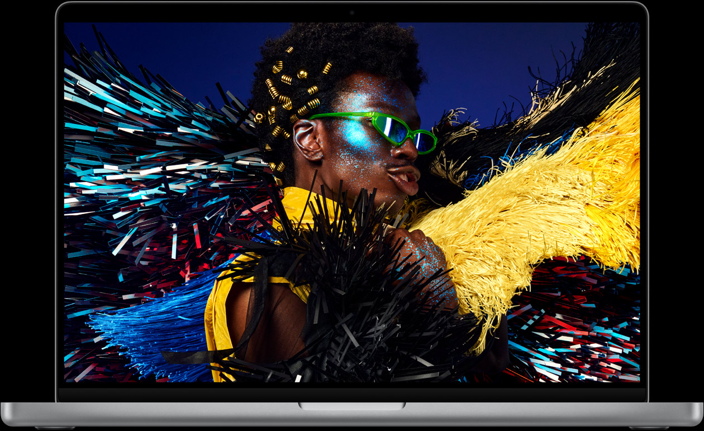
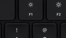

# GlowGoblin - Make Your MacBook Pro Screen Much Brighter



```text
*   \    |    /   *
    \   \\  |  //   /              G L O W   G O B L I N
     \   \\\|///   /
      `---(★ ★)---'                  tiny daemon.
            \v/                      giant photons.
            xdr                      zero flicker.
```

GlowGoblin is a source-only macOS daemon that lets MacBook Pro Liquid Retina XDR displays keep rolling past normal SDR brightness.

It has no Dock icon, no menu bar item, and no settings. Install it once, log in, and use the regular keyboard brightness keys. When you push brightness up, it lands in the extra-bright XDR range. When you play real HDR content, including YouTube HDR videos, macOS still handles HDR playback normally.

## Stock Max, Then Goblin Max

Your Mac's normal max brightness is still there. GlowGoblin leaves the familiar MacBook Pro range alone, then opens the XDR lane at the top of the native brightness keys.

Think of it as two clean zones:

The mental model: 50% is the old 100%. 100% is Goblin max. The actual handoff follows your MacBook's backlight scale, but the feel is stock first, boost second.

| Zone | What happens |
|---|---|
| Mac range | Native Apple brightness. No boost. No tricks. |
| Goblin range | XDR headroom opens. Same keys, brighter screen. |

Apple rates the MacBook Pro Liquid Retina XDR panel for [1000 nits sustained full-screen brightness and 1600 nits peak brightness](https://www.apple.com/macbook-pro/specs/) for HDR content. GlowGoblin does not pretend to be a lab meter. It simply lets the desktop ride into that built-in XDR headroom.

GlowGoblin is intentionally modest: it is not a color tool, not an HDR player, not a display calibration system, and not a claim that every Mac should run brighter all day. It is a tiny source-built daemon for people who want the panel headroom Apple already ships.



## Supported Macs

GlowGoblin targets Apple-silicon MacBook Pro models with a built-in Liquid Retina XDR display:

<table>
  <tr>
    <td align="center" valign="top" width="50%">
      
      <br>
      <strong>14-inch MacBook Pro</strong>
      <br>
      <sub>14.2 in Liquid Retina XDR</sub>
      <br>
      <sub>M1 Pro/Max, M2 Pro/Max, M3, M3 Pro/Max</sub>
      <br>
      <sub>M4, M4 Pro/Max, M5, M5 Pro/Max</sub>
    </td>
    <td align="center" valign="top" width="50%">
      
      <br>
      <strong>16-inch MacBook Pro</strong>
      <br>
      <sub>16.2 in Liquid Retina XDR</sub>
      <br>
      <sub>M1 Pro/Max, M2 Pro/Max, M3 Pro/Max</sub>
      <br>
      <sub>M4 Pro/Max, M5 Pro/Max</sub>
    </td>
  </tr>
</table>

Not supported: 13-inch M1/M2 MacBook Pro, MacBook Air including the 15-inch Air, Intel MacBook Pro, and non-XDR displays. The practical rule is simple: if your built-in MacBook Pro display is not Liquid Retina XDR, GlowGoblin is not for that machine.

## Why

Apple's XDR panels can get much brighter than the normal SDR desktop limit, but macOS usually reserves that headroom for HDR/EDR content. GlowGoblin keeps your normal brightness range native, then opens the XDR headroom only at the top of the keyboard brightness stack.

The important bit is the NoFlicker gate. Below the top range, GlowGoblin tears down its boost path and leaves the display tables alone. Above it, GlowGoblin brings up the EDR layer, applies the lift, and backs off while Apple's hardware brightness stack is actively moving. The result is native Mac behavior in the normal range and goblin brightness when you push past it.

## Why It Should Be Safe

The short version: GlowGoblin uses display headroom Apple already designed into Liquid Retina XDR MacBook Pro panels. It does not bypass macOS thermal management.

Apple publishes the MacBook Pro Liquid Retina XDR display at [1000 nits sustained full-screen brightness and 1600 nits peak brightness](https://www.apple.com/macbook-pro/specs/) for HDR content. Apple also documents that XDR displays can automatically [limit brightness in warm conditions](https://support.apple.com/en-us/101865), which means the display controller and macOS still sit below user-space apps like this one. GlowGoblin cannot turn that protection off.

GlowGoblin uses macOS Extended Dynamic Range behavior, the same public rendering path Apple documents for HDR/EDR apps in [WWDC 2021: Explore HDR rendering with EDR](https://developer.apple.com/videos/play/wwdc2021/10161/). The practical trick is that it keeps a tiny EDR-capable layer alive only when the keyboard brightness stack reaches the top range, then lets SDR desktop content ride higher inside that existing XDR envelope.

What this means in normal language:

| Question | Honest answer |
|---|---|
| Will it fry the panel? | It should not. GlowGoblin operates above Apple's display controller and cannot disable Apple's thermal brightness limiting. |
| Is this OLED burn-in territory? | No. These MacBook Pro panels are mini-LED LCD, not OLED. |
| Will battery life get worse? | Yes. More backlight means more power. |
| Will it run warmer? | Yes, especially at sustained high brightness. macOS may dim the panel if the display gets too warm. |
| Is SDR color still reference-accurate? | No. Use Apple's reference modes and disable GlowGoblin for grading, print matching, or color-critical work. |
| Could macOS change this later? | Yes. GlowGoblin relies on macOS EDR behavior, so a future display-stack change could require an update. |

## Install

Requirements:

- MacBook Pro with a Liquid Retina XDR display
- macOS 13 or newer
- Xcode Command Line Tools

One-command source install:

```sh
bash -c "$(curl -fsSL https://raw.githubusercontent.com/jtc268/glowgoblin/main/Scripts/bootstrap.sh)"
```

That command clones the repo, builds the app locally, installs `GlowGoblin.app` into `~/Applications`, and installs the visible LaunchAgent at `~/Library/LaunchAgents/app.glowgoblin.plist`.

Same install, fully inspectable:

```sh
git clone https://github.com/jtc268/glowgoblin.git
cd glowgoblin
./Scripts/install.sh
```

For the one-liner, the script is public and short:

```sh
https://github.com/jtc268/glowgoblin/blob/main/Scripts/bootstrap.sh
```

The app installs to:

```sh
~/Applications/GlowGoblin.app
```

The startup agent installs to:

```sh
~/Library/LaunchAgents/app.glowgoblin.plist
```

## Use

<p align="center">
  
</p>

Press the normal Mac brightness keys. There is no UI.

For color-critical work, disable GlowGoblin and use Apple's reference modes. GlowGoblin is for practical brightness, not reference grading. It intentionally pushes SDR desktop brightness beyond Apple's normal SDR behavior, so games and SDR apps can look different.

## Privacy and Security

GlowGoblin is source-only right now: no packaged binary, no updater, no analytics, and no network code in the app. The LaunchAgent is installed at:

```sh
~/Library/LaunchAgents/app.glowgoblin.plist
```

The app runs as your user, restores ColorSync display tables on uninstall, and can be removed with:

```sh
./Scripts/uninstall.sh
```

There are no hidden services or background network calls. The install script builds from this repository, copies the app bundle into `~/Applications`, and loads a user LaunchAgent so it starts at login. If you do not like `curl | bash`, use the clone-and-run path above and read the scripts first.

## What Makes It Different

GlowGoblin's opinion is simple: the native Mac brightness keys should stay the entire UX. The daemon stays invisible, lets the normal macOS brightness range behave natively, and only opens the XDR boost path once the top brightness range is reached.

The NoFlicker gate is the main engineering bet. During brightness-key movement, GlowGoblin backs away from the display tables so it is not fighting Apple's hardware brightness transition. At rest, it restores the boost. That is the whole product.

## Status

```sh
./Scripts/status.sh
```

## Uninstall

```sh
./Scripts/uninstall.sh
```

Uninstall stops the agent, removes the app, and restores ColorSync display tables.

## Notes

- Only built-in Apple XDR/EDR-capable displays are targeted.
- External displays are left alone unless macOS reports them as Apple XDR-like.
- Real HDR video playback still works; GlowGoblin is not an HDR player or tone mapper.
- GlowGoblin is source-only today. Signed and notarized releases would make installation smoother, but the current trust model is deliberately inspect-build-install.

## Credits

If the little glow goblin saves your eyeballs, you can quietly <a href="https://buymeacoffee.com/refresh1" target="_blank" rel="noopener noreferrer">drop a coffee in the cave</a>.

MIT licensed.
